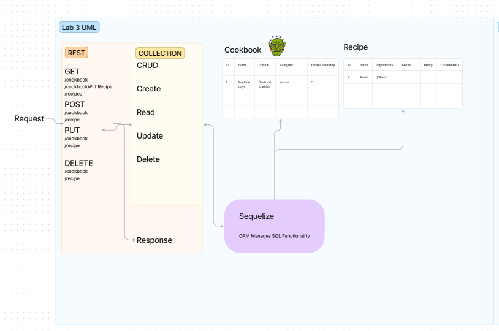
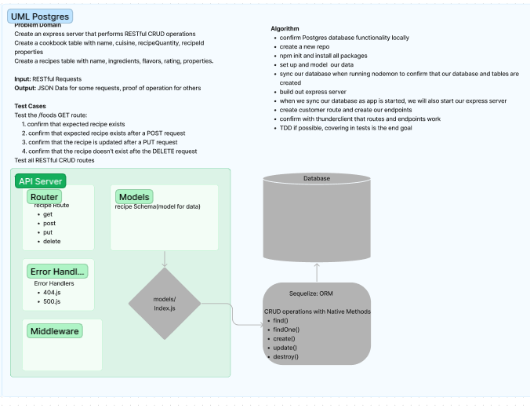

# LAB - Class 03

## Project: api-server

### Author: Student/Group Name
Nick M
### Problem Domain  

Build a REST API using Express, by creating a proper series of endpoints that perform CRUD operations on a Postgres SQL Database, using the REST standard.

### Links and Resources

- [GitHub Actions ci/cd(TBD)](https://github.com/nickmullaney/api-server/actions) 
- [back-end dev server url](https://api-server-dev-7der.onrender.com)
- [back-end prod server url](https://api-server-prod-xzvm.onrender.com) 

### Collaborators

Thanks to Roger Gallaway for the demo code, permission granted to use

Thanks to OpenAi for the assist on sections

Thanks to Ryan Eastman for going over lab 3 with feedback

Thanks to Reece Renninger for coworking together 
### Code Review Process

-Ryan is a great partner, he's got a very unique perspective and often times sees the small things that can be overlooked. He was able to point out some key mistakes in my code with my routes and ensuring that all the t's were crossed and the i's dotted. I was able to assist him in some error handling and cleaning up names and adding some useful comments. This was overall a great experience but we just chatted instead of doing the PR's

-Key Takeaways:
- I need to work on componetizing
- double checking routes
- missing small things like `:` or `/`'s in places.

#### `.env` requirements (where applicable)

port variable exists within the env sample

#### How to initialize/run your application (where applicable)

clone repo, `npm i`, then run `nodemon` in the terminal
- e.g. `npm start`

#### How to use your library (where applicable)

#### Routes
<!-- All routes should be documented -->
- GET : `/success` - specific route to hit
- GET : `/person` - specific route to hit
- GET : `/` - proof of life

#### Tests

to run tests after running `npm i`, run the command `npm test` 

#### UML

