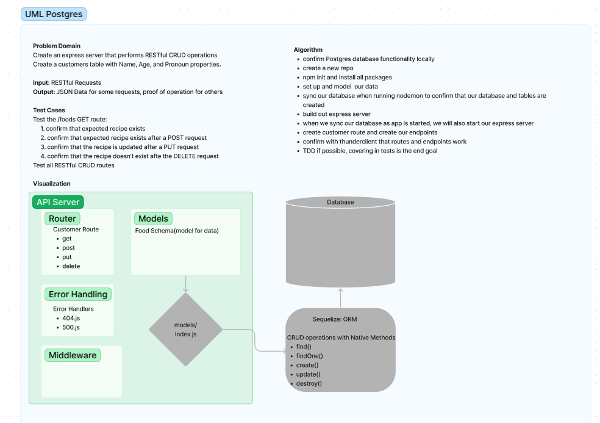

# LAB - Class 03

## Project: api-server

### Author: Student/Group Name
Nick M
### Problem Domain  

Build a REST API using Express, by creating a proper series of endpoints that perform CRUD operations on a Postgres SQL Database, using the REST standard.

### Links and Resources

- [GitHub Actions ci/cd(TBD)](https://github.com/nickmullaney/basic-express-server/actions) 
- [back-end dev server url(TBD)](https://basic-express-server-dev-s3kt.onrender.com)
- [back-end prod server url(TBD)](https://basic-express-server-prod-kctt.onrender.com) 

### Collaborators

Thanks to Roger Gallaway for the demo code, permission granted to use, Thanks to OpenAi for the assist on sections 
### Setup

#### `.env` requirements (where applicable)

port variable exists within the env sample

#### How to initialize/run your application (where applicable)

clone repo, `npm i`, then run `nodemon` in the terminal
- e.g. `npm start`

#### How to use your library (where applicable)

#### Routes
<!-- All routes should be documented -->
- GET : `/success` - specific route to hit
- GET : `/person` - specific route to hit
- GET : `/` - proof of life

#### Tests

to run tests after running `npm i`, run the command `npm test` 

#### UML

